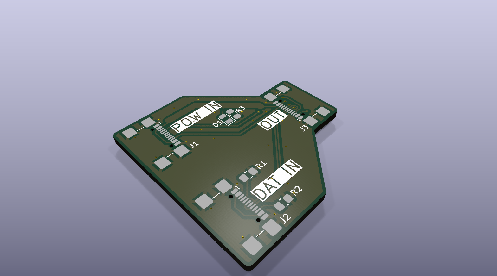

# USB-PD Splitter



A KiCad hardware design for a passive USB-C power and data splitter. The design combines power from a dedicated USB-C input with USB 2.0 data from a separate USB-C input and routes both to a single USB-C device output.

## Design intent

The design uses three USB-C connectors:

- `PWR_IN`: dedicated USB-C power source
  - Supplies `VBUS` and `GND` to `OUT`
  - Passes `CC1` and `CC2` to `OUT` for source-to-device role signaling
  - USB data pins are not connected and are marked DNP

- `DATA_IN`: USB-C host/data source
  - Supplies USB 2.0 `D+`, `D-`, and `GND` to `OUT`
  - Uses appropriate host/source-side CC pull-ups (`Rp`) for attachment and role detection
  - Its `VBUS` is isolated from the power path and is not connected to `OUT`

- `OUT`: USB-C powered device connection
  - Receives `VBUS`, `GND`, and CC signaling from `PWR_IN`
  - Receives USB 2.0 `D+` and `D-` from `DATA_IN`
  - Is intended to operate as the sink/device-side connection

This is a passive power-injection topology. It does not contain a USB-PD controller, USB data repeater, or role-switching circuitry. Power negotiation and USB-C attachment behavior depend on the connected source and device and must be validated with the intended hardware.

The design currently targets USB 2.0 data only; USB 3.x, USB4, and alternate-mode signals are not supported.

## Project structure

- `usb-pd-splitter.kicad_pro` - KiCad project file
- `usb-pd-splitter.kicad_sch` - main schematic file
- `usb-pd-splitter.kicad_pcb` - PCB layout file
- `usb-pd-splitter.kicad_jobset` - native KiCad validation/export jobset
- `hardware/symbols/` - custom schematic symbols
- `hardware/footprints/` - custom footprints
- `hardware/3d_models/` - 3D model assets
- `docs/` - design notes and reference documents
- `bom/` - reviewed, human-readable BOM snapshots
- `manufacturing/` - release profiles, notes, and inspection templates
- `automation/` - cross-platform Python release CLI and tests
- `outputs/` - disposable KiCad/plugin review exports
- `dist/` - immutable release packages; generated and ignored

## Manufacturing release

Install [KiCad 10](https://www.kicad.org/), make sure `kicad-cli` is on `PATH`, and
install [uv](https://docs.astral.sh/uv/). Run all commands below from the repository
root. The short version is `validate` -> `build` -> `inspect` -> JLCPCB draft upload
-> `package` -> tag -> guarded GitHub draft; the complete process is explained below.

1. **Set the release identity.** Update the schematic and PCB title-block revision,
   the `HW_REVISION` and `HW_VERSION` project variables, and the matching `revision`
   and `version` values in `manufacturing/profiles/jlcpcb.toml`. These values determine
   the release directory, archive name, manifest identity, and Git tag, so they must
   describe the same hardware revision everywhere.

2. **Complete fitted-part metadata.** In the schematic, give every non-DNP physical
   part a footprint plus `Manufacturer`, `MPN`, and `LCSC Part #`. The release tool
   generates the JLCPCB BOM from these authoritative KiCad properties; editing a
   generated CSV would only hide an incomplete source design.

3. **Mark hand-assembled parts DNP.** The default population policy is fitted. Any
   component that JLCPCB should not place must have KiCad's DNP attribute set, even
   if it will be installed by hand later. Non-DNP references are required to appear
   in both the generated BOM and component-placement list (CPL).

4. **Synchronize and save the design.** Save the schematic, update the PCB from the
   schematic, refill copper zones, and save the PCB. This makes the schematic, PCB
   footprints, routed nets, and zone fills agree before automated checks or exports.

5. **Refresh the tracked README render when necessary.** After changing the PCB,
   project settings, project-local 3D models, or render settings, run:

   ```powershell
   uv run --project automation hwrelease render-docs
   ```

   This regenerates `docs/assets/usb-pd-splitter-isometric.png` and its source-hash
   metadata. `validate` rejects a missing, modified, or stale render.

6. **Run the fast release preflight.** Run:

   ```powershell
   uv run --project automation hwrelease validate
   ```

   This checks required project files, revision/version agreement, the README render,
   fitted-part footprints and sourcing fields, and clean-tree policy. Repeat until it
   passes. It does not replace ERC or DRC. During unfinished local work only,
   `--allow-dirty` bypasses the clean-tree gate; do not use it for a formal release.

7. **Run the native KiCad checks as an independent review.** Open
   `usb-pd-splitter.kicad_jobset` in KiCad's Jobsets dialog, or run:

   ```powershell
   kicad-cli jobset run --stop-on-error --file usb-pd-splitter.kicad_jobset `
     --output "Local release staging" usb-pd-splitter.kicad_pro
   ```

   Review ERC, DRC, and the generated exports, and resolve every finding that is not
   deliberately excluded. The formal build later runs direct JSON ERC and DRC again,
   including schematic/PCB parity, because that is the authoritative automated gate.

8. **Commit, then build from the clean commit.** Once the design and review changes
   are complete, commit them and run:

   ```powershell
   uv run --project automation hwrelease build
   ```

   The build reruns preflight, ERC, DRC, zone refill, and schematic parity; generates
   Gerbers/drills, BOM, CPL, drawings, schematic PDF, STEP/render files, and exchange
   formats; checks BOM/CPL fitted-reference parity; and writes a manifest plus
   `SHA256SUMS` under `dist/usb-pd-splitter-rev-<rev>-v<version>/`. It refuses an
   existing release directory so a prior release cannot be silently overwritten.
   `--allow-warnings` and `--allow-dirty` are diagnostic-only development escapes;
   such a build cannot become a formal package.

9. **Inspect the generated release.** Run:

   ```powershell
   uv run --project automation hwrelease inspect
   ```

   This summarizes the newest release's source commit, dirty state, KiCad version,
   fitted references, and file count. Also verify `SHA256SUMS`, open the fabrication
   and assembly drawings, and compare `assembly/jlcpcb-bom.csv` and
   `assembly/jlcpcb-cpl.csv` with the JLCPCB Fabrication Toolkit output. Differences
   must be resolved in KiCad metadata or release automation, not patched in `dist/`.

10. **Optionally generate InteractiveHtmlBom.** Use it for internal visual review or
    hand-assembly guidance. It is convenient documentation, but it is not an
    authoritative fabrication or placement input.

11. **Perform a draft JLCPCB upload.** Upload
    `fabrication/jlcpcb-gerbers.zip`, `assembly/jlcpcb-bom.csv`, and
    `assembly/jlcpcb-cpl.csv` from the release directory without placing an order.
    Check every part match, side, centroid, pin-1/polarity indication, and rotation in
    the placement preview. Record persistent corrections in KiCad properties and
    rebuild; never treat a one-off upload edit as the source fix.

12. **Create the formal archive.** After the placement preview is approved, run:

    ```powershell
    uv run --project automation hwrelease package
    ```

    This revalidates the clean current sources, the release manifest and source hashes,
    zero ERC/DRC warnings or errors, BOM/CPL parity, required manufacturing assets, and
    every entry in `SHA256SUMS`. It then creates the complete release ZIP and a separate
    `.zip.sha256` file in `dist/`.

13. **Tag and push the approved commit.** Create the version tag required by the
    manufacturing profile and push it, for example:

    ```powershell
    git tag hardware-v1.1.0
    git push origin hardware-v1.1.0
    ```

    The tag must resolve locally and on `origin` to the exact clean commit recorded in
    the package. Adjust the version to match `manufacturing/profiles/jlcpcb.toml`.

14. **Create and review a guarded GitHub draft.** After `gh auth login`, run:

    ```powershell
    uv run --project automation hwrelease publish --draft --placement-reviewed
    ```

    `--draft` prevents accidental public publication, and `--placement-reviewed` is an
    explicit assertion that the human JLCPCB preview check is complete. The command
    rechecks the package and remote tag, then uploads the archive, checksums, Gerber ZIP,
    BOM, and CPL to a draft release. Inspect every asset before publishing the draft in
    GitHub, or publish explicitly with
    `gh release edit hardware-vX.Y.Z --draft=false --latest`.

15. **Approve the first article, not merely the files.** Inspect and document the first
    assembled board against `manufacturing/templates/inspection-checklist.md`. Confirm
    assembly orientation and workmanship, then perform electrical bring-up and the
    intended USB-C power/data tests before authorizing repeat builds.

Generated `outputs/` and `dist/` files are review artifacts, not source files, and no
command above places a JLCPCB order. See [the formal release-process checklist](docs/manufacturing/release-process.md)
and [the manufacturing tooling rationale](docs/manufacturing/tooling-decisions.md).

## Notes
This design is a passive power/data splitter, not a USB Power Delivery controller. It assumes:
- `PWR_IN` supplies `VBUS` and negotiates PD directly with the device on `OUT`
- `DATA_IN` is the host-side data connection and provides USB signaling to `OUT`
- `OUT` is the powered device and receives `VBUS` from `PWR_IN` and data from `DATA_IN`

Because the power and data paths are separated, this is effectively a power injector topology and should be verified with the target host and device hardware.

## Working conventions

- Treat the KiCad schematic as the source of truth for connectivity.
- Keep reusable source assets under `hardware/`; keep generated exports under `outputs/`.
- Record unresolved electrical-role decisions in `docs/` before committing the final schematic.
- Treat `Manufacturer`, `MPN`, and `LCSC Part #` as required properties for every fitted part.
- Mark anything intended for hand assembly DNP; JLCPCB places every non-DNP part.
- Never hand-edit a generated BOM/CPL as the lasting fix; correct KiCad metadata instead.
